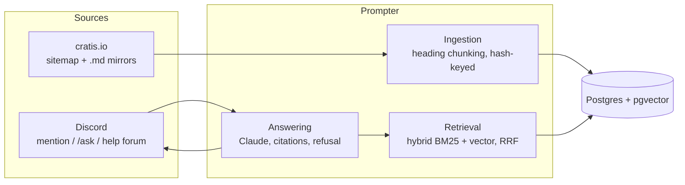

Prompter is a single deployable with one database. It is a retrieval-augmented generation (RAG) pipeline: the
documentation is never trained into a model - it is indexed, and relevant excerpts are given to the model per
question, which is why answers stay current with the docs.

## Ingestion

The documentation site already publishes a sitemap and a markdown mirror of every page on each deploy.
Ingestion walks the sitemap, fetches each page's markdown mirror, splits pages into chunks along their
heading structure, and embeds only
chunks whose content hash changed since the last run. Generated code-snippet fragments are excluded. A
re-index is triggered by the same `build-docs` dispatch event that rebuilds the documentation site.

## Retrieval

Retrieval is hybrid: full-text search (BM25-style, Postgres `tsvector`) and semantic search (embedding cosine
similarity, pgvector) run in a single SQL query and are fused with reciprocal rank fusion. Hybrid retrieval
roughly halves retrieval failure compared to embeddings alone in published benchmarks, and it is the one
quality technique Prompter commits to from day one.

## Answering

The model receives only the retrieved excerpts and must answer from them - answers reference the excerpts
they used, and those pages are attached as source links. When the best passage scores below a confidence
threshold, Prompter refuses instead of guessing. Every interaction is recorded (with a hashed user identifier)
so answer quality is measured against a golden question set rather than assumed.
