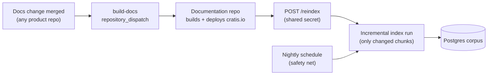

# Content & freshness — how Prompter always knows the latest

Owns two concerns: **where Prompter's knowledge comes from** (the content-source roadmap) and **how it stays
current** (the freshness architecture). Detail for in-flight items lives in
[`IMPLEMENTATION_PLAN.md`](IMPLEMENTATION_PLAN.md); this doc is the durable design.

## The mental model — three parts that move independently

RAG decouples the bot from its knowledge. Prompter is three separately-moving parts, and only one of them
"deploys":

| Part | Lives where | Changes when | How it updates |
|---|---|---|---|
| **The app** (bot code) | Docker image `cratis/prompter` on the VPS | We change Prompter's code | Release via `publish.yml` → `docker compose pull && up -d` (seconds of downtime, rare) |
| **The knowledge** (corpus) | Postgres — chunks + embeddings | Documentation changes | **Re-index, not redeploy**: the indexer upserts only changed chunks; the bot keeps answering throughout — zero downtime, no new image |
| **The model** (Claude/Voyage) | Anthropic/Voyage APIs | Vendor releases | Config value (`Anthropic:Model`) — nothing to deploy |

**"Deploy Prompter every time we deploy documentation" therefore becomes: "trigger a re-index every time
documentation deploys."** Same outcome — the bot knows the latest within minutes — at a fraction of the cost:
an incremental re-index embeds only what changed (content-hash keyed), typically a handful of chunks, a few
cents, under a minute. The bot binary only redeploys when *its own code* changes.

## Freshness architecture

1. **Event-driven (primary):** the existing pipeline already ends with cratis.io deploying. We add one step
   at the end of the Documentation repo's `docs-site.yml` deploy job: call Prompter's `POST /reindex`
   (M5.1/P-20). The chain "merge docs → site deploys → Prompter re-indexes" is fully automatic; freshness lag
   is the site build time plus ~a minute.
2. **Scheduled (safety net):** a nightly full pass (P-05) catches anything the event path missed (webhook
   down, manual site fixes). Because runs are incremental, a no-change nightly run costs nothing.
3. **Never stale-served:** re-indexing upserts chunk-by-chunk; retrieval sees old content until the moment
   each chunk is replaced. There is no rebuild-the-world downtime and no cache to invalidate.

**Source-code freshness — the honest limit:** Prompter learns about code only through *published content*.
If a new Chronicle feature ships without docs, Prompter cannot answer it — same as a human reading cratis.io.
Two mitigations: (a) the docs-discipline Cratis already enforces (docs gates in the Definition of Done), and
(b) ingesting **release notes** (Phase 2 below) so "what's new in 16.0.6" is answerable the moment a release
is published, even before narrative docs catch up.

## Content-source roadmap

Every source gets: its own connector behind the ingestion seam, a `source` tag on chunks, **citation
attribution** (an answer must say whether it comes from docs, a release note, or a community answer), and its
own refresh trigger. Retrieval can then weight sources (docs > release notes > community).

| Phase | Source | Why | Refresh | Notes |
|---|---|---|---|---|
| **1 (v1, live)** | cratis.io docs (~870 pages via sitemap + `.md` mirrors) | The ground truth | Webhook + nightly | Done — this is the current corpus |
| **2 (v1.x)** | **Release notes** — GitHub Releases of Chronicle, Arc, Fundamentals, Components, cli | "What changed in X?" is a top community question and the freshest signal we have | GitHub `release` webhook or nightly | Small, high-value, trivial to chunk |
| 2 | **Glossary + AI rules as prompt grounding** (`AI/.ai/rules/glossary.md`, writing conventions) | Consistent terminology in answers ("the Cratis way") | On AI-repo change | Not retrieval — goes into the system prompt |
| 2 | **Samples** — READMEs + curated sample files from `Cratis/Samples` | "Show me working code" answers | Nightly | Chunk code files whole-file with a path header; cite the GitHub URL |
| **3 (v2)** | **Solved help-forum threads** from our own Discord | Community answers cover what docs don't; this is what makes mature bots feel omniscient | After thread marked solved | **GDPR/consent required**: ingest only threads marked solved, strip author identities, post a channel notice that solved threads become bot knowledge, honor opt-out. Cite as "community answer" |
| 3 | **GitHub Discussions / answered issues** across product repos | Same rationale as forum threads, public data | Nightly | Filter to answered/closed-as-resolved |

Deliberately **not** ingested: raw source code of the products (huge, low answer value vs. docs+samples,
drowns retrieval), the generated API reference (already excluded — poor prose grounding), and unsolved chat.

## Ecosystem-fit enhancements (what turns "good" into "great")

- **Product-aware retrieval** — when the question names a product (Chronicle, Arc, Components, cli,
  Fundamentals), boost/filter chunks whose page path lives under that product. Cheap (path prefix is already
  in `page_url`) and kills the classic cross-product confusion failure.
- **Client-language awareness** — Fundamentals/Chronicle docs split by C#/TypeScript (later Kotlin/Elixir):
  detect the asker's language from the question ("in Kotlin?") and prefer that variant's pages.
- **The docs-gap flywheel** — Prompter's refusals and 👎-reactions are a *measurement of missing docs*.
  Weekly digest (start: a pinned message in a maintainer channel; later: auto-filed issues in the right
  product repo, fitting the existing docs-CI culture). This is how the bot pays the docs team back.
- **Docs MCP server** — expose `IPassages.Search` as an MCP tool alongside Chronicle.Mcp, so Claude
  Code/Copilot/Cursor users get the same grounded retrieval the Discord bot uses. One retrieval layer, every
  AI surface in the ecosystem. (Promoted from parking lot to Phase 2–3 roadmap.)
- **Chronicle dogfooding** (D-6, still open) — the interaction log as events is the natural adoption point.

## What this means for the pipelines (once Cratis/Prompter is on GitHub)

- `publish.yml` (exists): releases the **app** image on merged PRs — unrelated to content.
- Documentation repo `docs-site.yml`: + one `curl -X POST` step to `/reindex` after deploy (team change, P-20).
- Prompter repo: nightly `reindex.yml` schedule hitting the same endpoint (safety net, P-05).
- Product repos: nothing to change — their existing `build-docs` dispatch already feeds the chain.
