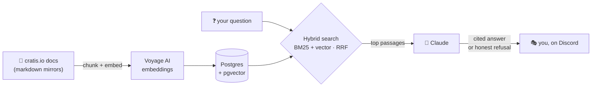

<div align="center">

# 🎭 Prompter

**The Cratis community's docs assistant — living on Discord, grounded in the docs, allergic to making things up.**

[](https://discord.gg/kt4AMpV8WV)
[](https://hub.docker.com/r/cratis/prompter)
[](https://github.com/Cratis/Prompter/actions/workflows/build.yml)
[](https://github.com/Cratis/Prompter/actions/workflows/publish.yml)

</div>

---

In theater, the **prompter** sits just offstage with the script and quietly feeds the line to anyone who blanks
mid-scene. That's the whole idea. The script is the published documentation at
[cratis.io](https://cratis.io); the stage is the Cratis Discord; and when someone forgets their line —
*"wait, how do I append an event again?"* — Prompter whispers the answer, **with citations**, or admits
honestly when the docs don't cover it.

No hallucinated APIs. No confidently-wrong snippets. Just the docs, retrieved and read back to you where you
already are.

## 🎭 Why "Prompter"?

Three reasons, and they all line up:

- **The theater prompter** feeds you the line you forgot from just offstage — never stealing the scene, always
  working from the script. That's exactly the role: the docs are the script, and the bot only speaks when
  someone needs the line.
- **The LLM double meaning** — Prompter *prompts* a language model for a living. The name wears its
  machinery on its sleeve.
- **The Cratis storytelling family** — Cratis names its products after telling a story: **Chronicle** records
  what happened, **Arc** shapes the plot, **Narrator**, **Lens**, **Studio**… **Prompter** joins the cast.

See decision [D-1](Planning/DECISIONS.md) for the full rationale.

## 💬 What a scene looks like

```text
you  ·  #help
  How do I define a command in Arc?

🎭 Prompter  ·  replies to you
  In Arc a command is a record marked [Command]; its Handle() method
  returns the event(s) that happened — one file, backend to event:

    [Command]
    public record RegisterAuthor(AuthorId Id, AuthorName Name)
    {
        public AuthorRegistered Handle() => new(Name);
    }

  Arc then generates the TypeScript proxy so React calls it type-safe.

  📚 Sources
   • Cratis — One feature, one slice, typed end to end (cratis.io)

  👍  👎        ← tell us if that helped
```

Ask it about something the docs *don't* cover and it won't improvise — it tells you it doesn't know and points
you at a human. That honesty is the feature.

## ✨ How to summon it

- **@mention** `@Prompter` anywhere it can see — it replies in-thread, right where you asked.
- **`/ask`** — the slash command, for a clean one-off question; it shows a "thinking…" indicator while it
  looks things up, then delivers the cited answer.
- **`#ask-ai`** — a dedicated channel where every message is treated as a question, no mention needed.
- **Help forum** — open a new thread in the help forum and Prompter takes the first swing automatically, so
  you're never waiting on the timezone gods for a first answer.
- **👍 / 👎 buttons** — one click under any answer; the verdict is logged so the docs (and the bot) get better.

> Prompter never barges into normal conversation — it only speaks when spoken to, and it rate-limits each
> person to a handful of questions per window so no one can spam it. See
> [`DISCORD_INTEGRATION.md`](Planning/DISCORD_INTEGRATION.md) for the full behavior contract.

## 🧠 How it works

A small, honest RAG pipeline — hybrid retrieval (keyword **and** meaning), then a grounded answer with
citations:



- **Ingest** — walk cratis.io's sitemap, fetch each page's markdown mirror, strip the MDX noise, and split
  into heading-aware chunks. Only changed chunks are re-embedded, so re-indexing is cheap.
- **Retrieve** — one SQL query fuses lexical (BM25 via `tsvector`) and semantic (cosine over pgvector) hits
  with Reciprocal Rank Fusion. Anthropic's own benchmarks show hybrid roughly halves retrieval misses.
- **Answer** — Claude gets the top passages and a system prompt that demands grounding and citations, and
  refuses when the score says the docs don't have it.

Built with **C# / .NET 10**, [NetCord](https://netcord.dev),
[Microsoft.Extensions.AI](https://learn.microsoft.com/en-us/dotnet/ai/), **Claude** (Anthropic), **Voyage AI**
embeddings, and **Postgres + pgvector**. Why these? The receipts are in
[`Planning/DECISIONS.md`](Planning/DECISIONS.md).

## 🚀 Quick start

Bring up Postgres (with pgvector):

```bash
docker compose up -d
```

Index the documentation, then ask a question straight from your terminal:

```bash
cd Source
dotnet run -- index                                        # ingest cratis.io into the corpus
dotnet run -- ask "How do I append an event in Chronicle?" # answer from the CLI (add --verbose for the passages)
```

Run it as the Discord bot — bot mode also serves `GET /healthz` and the shared-secret `POST /reindex` webhook,
and sweeps expired interactions on a daily retention job:

```bash
dotnet run
```

Measure answer quality against the golden question set (from the repo root; needs the keys plus an indexed corpus):

```bash
dotnet run --project Eval                                   # groundedness, citation, and refusal scores
```

> You'll need a (free) **Voyage** API key to index and an **Anthropic** key to answer — see the table below.

## ⚙️ Configuration

Configuration binds to the `Cratis:Prompter` section (environment variables use `__` as the delimiter):

| Setting | Environment variable | Default |
|---|---|---|
| Postgres connection string | `Cratis__Prompter__ConnectionString` | localhost, db/user/pass `prompter` |
| Docs site to ingest | `Cratis__Prompter__DocsSiteUrl` | `https://cratis.io` |
| Embedding batch size | `Cratis__Prompter__Voyage__BatchSize` | `128` |
| Discord bot token | `Cratis__Prompter__Discord__Token` | — |
| Ask channel (mention-free questions) | `Cratis__Prompter__Discord__AskChannelId` | — |
| Help forum channel (auto-reply) | `Cratis__Prompter__Discord__HelpForumChannelId` | — |
| Rate limit — questions per window | `Cratis__Prompter__Discord__RateLimit__MaxQuestions` | `5` |
| Rate limit — window length (minutes) | `Cratis__Prompter__Discord__RateLimit__WindowMinutes` | `10` |
| Answer timeout (seconds) | `Cratis__Prompter__Discord__AnswerTimeoutSeconds` | `60` |
| Anthropic API key | `Cratis__Prompter__Anthropic__ApiKey` (or `ANTHROPIC_API_KEY`) | — |
| Answer model | `Cratis__Prompter__Anthropic__Model` | `claude-sonnet-5` |
| Refusal threshold (min top-passage score) | `Cratis__Prompter__Answering__MinScore` | `0.02` |
| Voyage API key | `Cratis__Prompter__Voyage__ApiKey` | — |
| Interaction retention (days) | `Cratis__Prompter__RetentionDays` | `90` |
| Re-index webhook secret | `Cratis__Prompter__ReindexSecret` | — |

API keys are never committed — use environment variables or a git-ignored `Source/appsettings.Development.json`.

## 🗺️ Start here (for contributors)

- [`Planning/SESSION_HANDOVER.md`](Planning/SESSION_HANDOVER.md) — current state and next actions. **Start here to pick up work.**
- [`Planning/V1_PLAN.md`](Planning/V1_PLAN.md) — the roadmap: milestones M0–M5 and the definition of done.
- [`Planning/IMPLEMENTATION_PLAN.md`](Planning/IMPLEMENTATION_PLAN.md) — the detailed plan to feature-complete v1.
- [`Planning/DISCORD_INTEGRATION.md`](Planning/DISCORD_INTEGRATION.md) — the Discord behavior contract and app-setup runbook.
- [`Planning/DECISIONS.md`](Planning/DECISIONS.md) — durable decisions (the name, build-vs-buy, the stack, GDPR posture).
- [`Documentation/architecture.md`](Documentation/architecture.md) — how ingestion, retrieval, and answering fit together.

## ✅ Quality gates

```bash
dotnet build --configuration Release   # zero warnings, zero errors (warnings are errors in Release)
dotnet test  --configuration Release   # all specs green
```

And one more gate that's unusual for a bot: **answer quality is measured, not vibed.** A golden-question eval
harness (milestone M4) scores groundedness, citation accuracy, and refusal behavior — and gates prompt and
retrieval changes the same way specs gate code.

---

<div align="center">

*Part of the [Cratis](https://cratis.io) platform · Licensed under the [MIT license](LICENSE)*

</div>
